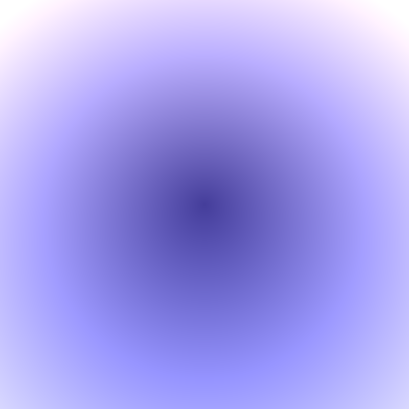
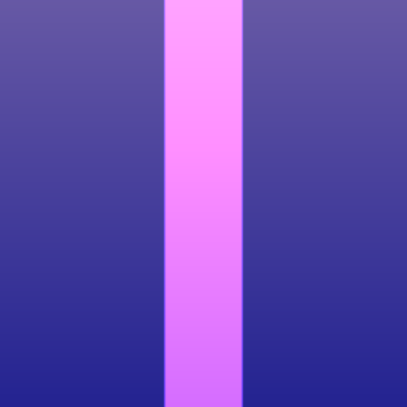
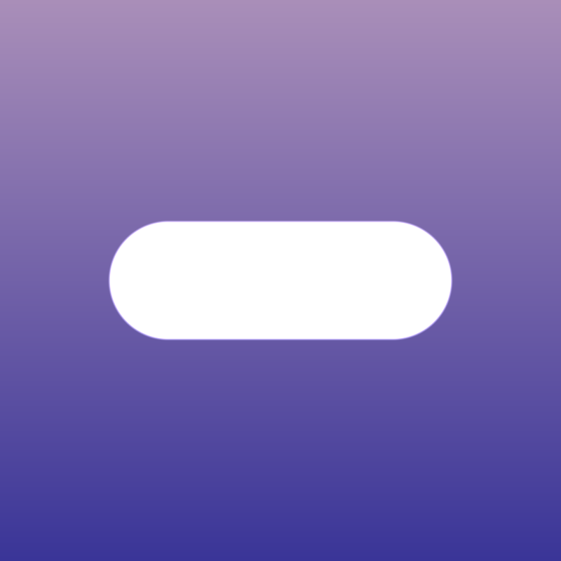
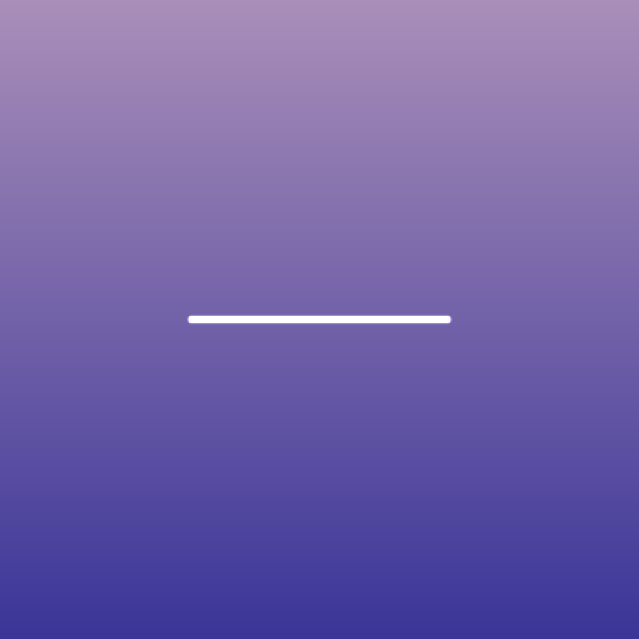
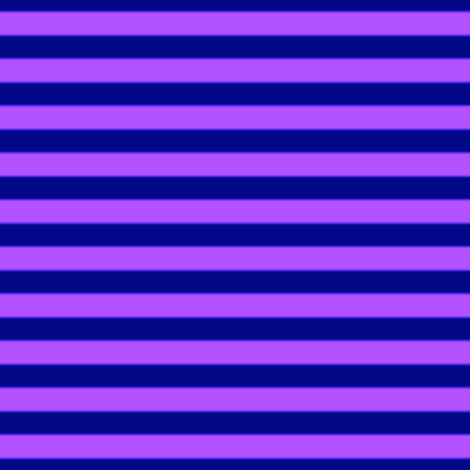
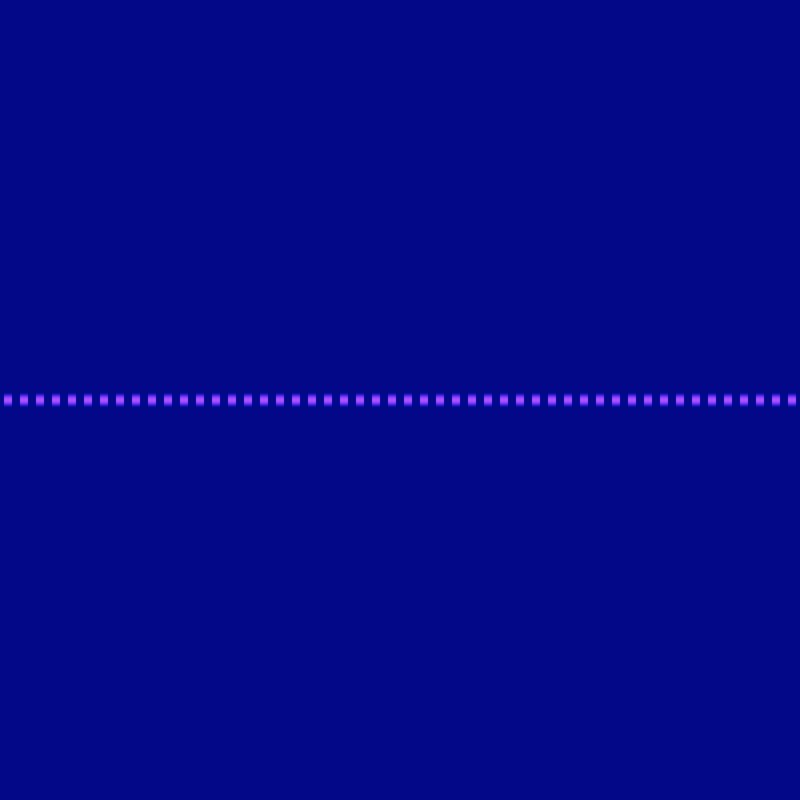

# Shader-Resources

I will be adding resources for making P5.js shaders to this respository.

I am relying heavily on the following resourses:

- The website of Inigo Quilez https://iquilezles.org 
and his youtube tutorials https://www.youtube.com/c/InigoQuilez

- The Art of Code tutorials on Youtube by Martijn Steinrucken.
https://www.youtube.com/c/TheArtofCodeIsCool/featured

## 1.  Understanding and remapping the uv coordinates

In a shader, the uv's start out as floating point values from 0.0 in the lower left corner of the screen to 1.0 in the top right corner of the screen.  Typically the first line of code in the main() function 
remaps the (0.0, 0.0) to the center of the screen.  We divide by the y coordinate to maintain the aspect ratio.

  `vec2 uv = gl_FragCoord.xy-0.5*u_resolution.xy/u_resolution.y;`
 
It is also typical to initially set the rgb colors to black using one of the following equivalent lines of code.

`vec3 col = vec3(0);`
`vec3 col = vec3(0.0, 0.0, 0.0)`;

It is important to remember that all the shader is doing is using matrix operations to change the uv value for each pixel on the screen, which is passed to gl_FragColor at the end of the file.  We can visualize the result of remapping the uvs using the following code.  We have to add .rg or .rb. or .gb becasue the uvs are a vec2 and col is a vec3.

`col += uv.rg;`

## 2.  Adding Color

We can define our colors at the top of the frag file.  We divide by 255. to change the RGB values to floating point.

`#define BLUE vec3(43,65,98)/255.`

`#define PINK vec3(225,187,201)/255.`

`#define PURPLE vec3(177,74,237)/255.`

We can add the color to the background by writing:

`col += BLUE;`

If instead we wanted to add a color gradient, we can do this by adding the following function to the frag file.  It is also convienent to provide a shortcut for calling the function.

`#define CG colorGradient`

`vec3 colorGradient(vec2 uv, vec3 col1, vec3 col2, float m) {
  float k = uv.y*m + m;
  vec3 col = mix(col1, col2, k);
  return col;
}`

`col += CG(uv, BLUE, PINK, .5);`

### 2. Lines

Horizontal Line

<code>
// d = uv.x * 0. + uv.y * 1.
vec3 Line(vec2 uv) {
  vec3 col = vec3(0);
  //float d = dot(uv, vec2(0.0, 1.0));
  float d = uv.y;
  float m = S(.008, 0., d);
  return col += m;
}
</code>

We can create a diagonal line by subtracting a vector with the cos(a) and  sin(a).  We adjust the slope by changing the angle.
<code>
vec3 diagonalLine(vec2 uv) {
  vec3 col = vec3(0);
  float angle  = PI * .16;
  float d = dot(uv, vec2(cos(angle), sin(angle) ) );
 
  float m = S(-.01, .01, d);
  return col += m;
}
</code>
## 3.  Shapes

### Circle

The distance function will give us the length of a vector from a uv coordinant point to the origin.

`vec2 origin = vec2(0.0, 0,0);`

`float d = length(uv- origin);`

We can use the smoothstep function to cut out a circle.

`float m = smoothstep(.1, 0.09, d);`

We can  multiply m by a color to change the color of the circle.
`col += m*PURPLE;`

We can change the position of the circle by remapping the origin of the uvs to another point.  For example, we can move the circle up by changing the y coordinate.

`origin = vec2(0.0, 0.2)`.

### Vertical Bar

If we change origin to `vec2(0.0, p.y)`, we get an infinite vertical bar.

### Pill 
We can change it to a pill shape by clamping the y values.

`origin =  clamp(-0.3, 0.3, uv.y);`

### Line
We can draw a line by adjusting the values in the smoothstep function.

`float m = S(.01, .0, d);`

### Changing the thickness of the pill

We can change the thickness of the pill by adjusting the value of d in the smoothstep function.  The most efficient way to do this is by creating a radius variable we will call r.

<code>
 float d = length(uv - vec2(clamp(-.2, 0.2, uv.x), 0. ) );
    float r = .1;
    float m = S(.008, .0, d - r);
  </code>

    

### Varying the thickness of the pill

### Diagonal Line

If we wanted a diagonal line that runs from bottom left to top right, we just put the uv.x coordinates in origin.

`vec2 origin = vec2(uv.x);`

`float d = length(uv - origin);`

`float m = S(.01, .0, d);`

`col += m*PURPLE;`

### Square

 If we want a square, we clamp both the uv.x and uv.y and multiply col by m*PURPLE.

  vec2 ypos = vec2(0.0, clamp(-0.3, 0.3, uv.y) );
  vec2 xpos = vec2(clamp(-0.3, 0.3, uv.x), 0.0);   

### Teardrop

<code>
float d1 = length(uv - vec2(0., clamp(-.3, 0.3, uv.y)) );
    float r = mix(.1, .01, S(-.3, .3, uv.y)) ;
    float m1 = S(.01, .0, d1 - r);
    </code>

You can change the appearance of the teardrop by changing the parameters in the mix function.
 `float r = mix(.175, .02, S(-.3, .3, uv.y));`
## 4.  Adding Patterns

### Landscape

<code>
 float d1 = length(uv - vec2(clamp(-.2, 0.2, uv.x), 0. ) );
    float r = S(-.2, .2, uv.y);
    float m1 = S(.008, .0, d1 - r);
</code>  

 float d1 = length(uv - vec2(0., clamp(-.3, 0.3, uv.x)) );
    float r = S(-.3, .3, uv.y);
    float m1 = S(.01, .0, d1 - r);   

This code creates a big valley.  
<code>
    float d1 = length(uv - vec2(0., clamp(-.3, 0.3, uv.y)) );
    float r = S(-.3, .3, uv.y);
    float m1 = S(.01, .0, d1 - r);
    </code>

### 1. Grid Pattern

What if we wanted to add a grid pattern to the screen? We do this by multiplying the uvs by a scale factor.  Suppose
we want a 2X2 grid.  We can do this by multiplying the uvs by 2.0, take the fractional compoment, and assign the value to a new vec2 we will call st.

` vec2 st = fract(uv*2.0);`

We will use `col.rg += st;` to visualize the result. 

 We now have four boxes, each of which has uvs that go from 0.0, 1.0.  We remap the uvs so that 0.0, 0.0 is in the center of the screen by subtracting 0.5.

`st = st - 0.5;`

It would be fun to color each of the boxes a different color.  We can do that by using the floor function to get an index for each box, and then use a loop to assign either blue or yellow to each box.

### Diagonal Lines

<code>
vec3 diagonalLines( vec2 uv ) {
  vec2 st = fract(uv*20.);
  
  vec3 col = vec3(0);
  float d =  length(st - vec2(st.x) );
  float m = S(.008, .0, d);
  col += m;
  return col;
}</code>

### Horizontal Stripes

<code>
float stripes(vec2 uv) {
  float d = length( uv-vec2( 0., clamp(uv.y, -.3, .3) ) );
  float r = mix(.1, .01, S(-.3,.3, uv.y));
  float m = S(.01, .0, d-r);
  // Create 10 horizontal stripes with origin in middle of each stripe
  float thickness = .2;
  float num = 50.;
  float stripes = S(.1, .0, abs(fract(uv.y*num)-.5) - thickness);
  return stripes;
}
</code>
In the main() function we can call stripes and give them the color purple.
<code>
 float  s = stripes(uv);
    col += s*PURPLE;
</code>

### Dashed Line

<code>
float dashedLine(vec2 uv) {
  float d = length( uv-vec2( clamp(uv.x, -.5, .5), 0. ) );
  float r = mix(.1, .01, S(-.5,.5, uv.x));
  float m = S(.01, .0, d);
  // Create 10 horizontal stripes with origin in middle of each stripe
  float thickness = .2;
  float num = 50.;
  float dashes = S(.1, .0, abs(fract(uv.x*num)-.5) - thickness);
  return dashes*m;
}
</code>

### Dashed Arrows
<code>
float dashedArrows(vec2 uv) {
  float d = length( uv-vec2( clamp(uv.x, -.5, .5), 0. ) );
  float r = mix(.1, .01, S(-.5,.5, uv.x));
  float m = S(.02, .0, d);
  // Create 10 horizontal stripes with origin in middle of each stripe
  float thickness = .15;
  float num = 40.;
  float x = abs(uv.y);
  float y = (uv.x+ x)*num;
  float arrows = S(.01, .0, abs(fract(y)-.5) - thickness);
  return arrows*m;
}
</code>

### Diagonal Pattern
<code>
float diagonalPattern(vec2 uv) {
  float d = length( uv-vec2( clamp(uv.x, -.5, .5), 0. ) );
  float r = mix(.1, .01, S(-.5,.5, uv.x));
  float m = S(.02, .0, d);
  // Create 10 horizontal stripes with origin in middle of each stripe
  float thickness = .15;
  float num = 40.;
  // Take absolute value of y coordinates to create v shaped diagonals
  float x = abs(uv.y);
  // Add x and stripes face right, subtract and stripes face left
  float y = (uv.x+ x)*num;
  float stripes = S(.01, .0, abs(fract(y)-.5) - thickness);
  return stripes;
}
</code>

### Curved Cross

float curvedCross(vec2 uv) {
  float d = length( uv - vec2( 0., clamp(uv.y, -.3, .3) ) );
  float r = mix(.1, .01, S(-.4,.4, uv.y));
  float m = S(.02, .0, d-r);
  // Create 10 horizontal stripes with origin in middle of each stripe
  float thickness = .25;
  float num = 1.;
  float x = abs(uv.x);
  float curvature = (1. - x) * pow(x, 2.) + x * (1. - pow(x, 2.));
  float y = abs(curvature*uv.y);
  float curve = S(.01, .0, abs(fract(y)-.35) - thickness);
  return curve;
}

### Hill
<code>
float hill(vec2 uv) {
  float d = length( uv - vec2( 0., clamp(uv.y, -.5, .5) ) );
  float r = mix(.1, .01, S(-.5,.5, uv.y));
  float m = S(.02, .0, d-r);
  float thickness = .45;
  float x = abs(uv.x);
  // Define curvature of hill
  float curvature = (1. - x) * pow(x, 2.) + x * (1. - pow(x, 2.));
  float y = abs(curvature+uv.y);
  //Take abs(uv.y) to get convex shape
  float h= S(.01, .0, abs((y)) - thickness);
  return h;
}
</code>
## 5.  Movement

## 6.  2D objects

## 7.  3D objects

## 8.  Joining objects

## 9.  Creating Scenes
