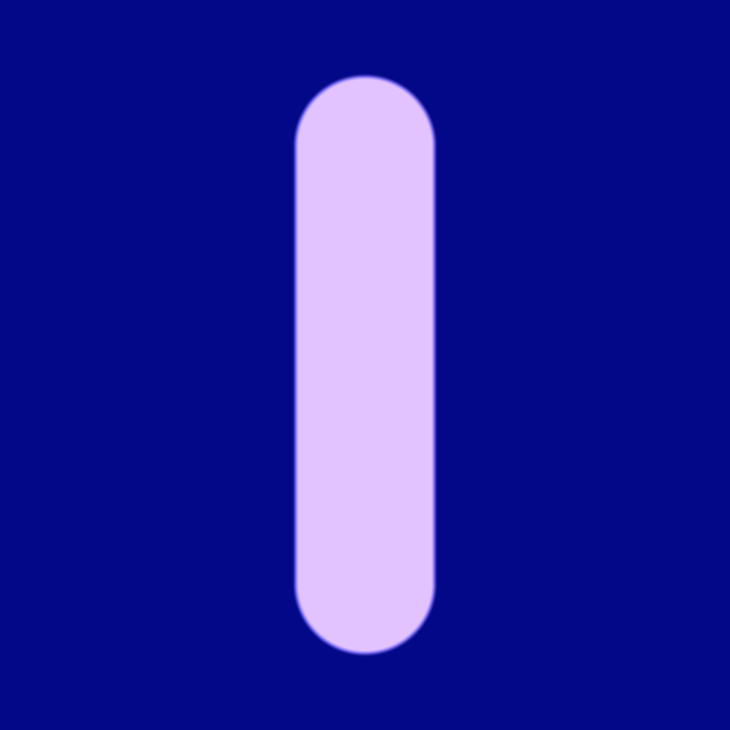

# Shader-Resources

I will be adding resources for making P5.js shaders to this respository.

I am relying heavily on the following resourses:

- The website of Inigo Quilez https://iquilezles.org 
and his youtube tutorials https://www.youtube.com/c/InigoQuilez

- The Art of Code tutorials on Youtube by Martijn Steinrucken.
https://www.youtube.com/c/TheArtofCodeIsCool/featured

## 1.  Understanding and remapping the uv coordinates

In a shader, the uv's start out as floating point values from 0.0 in the lower left corner of the screen to 1.0 in the top right corner of the screen.  Typically the first line of code in the main() function 
remaps the (0.0, 0.0) to the center of the screen.  We divide by the y coordinate to maintain the aspect ratio.

  `vec2 uv = gl_FragCoord.xy-0.5*u_resolution.xy/u_resolution.y;`
 
It is also typical to initially set the rgb colors to black using one of the following equivalent lines of code.

`vec3 col = vec3(0);`
`vec3 col = vec3(0.0, 0.0, 0.0)`;

It is important to remember that all the shader is doing is using matrix operations to change the uv value for each pixel on the screen, which is passed to gl_FragColor at the end of the file.  We can visualize the result of remapping the uvs using the following code.  We have to add .rg or .rb. or .gb becasue the uvs are a vec2 and col is a vec3.

`col += uv.rg;`

## 2.  Adding Color

We can define our colors at the top of the frag file.  We divide by 255. to change the RGB values to floating point.

`#define BLUE vec3(43,65,98)/255.`
`#define PINK vec3(225,187,201)/255.`
`#define PURPLE vec3(177,74,237)/255.`

We can add the color to the background by writing:

`col += BLUE;`

If instead we wanted to add a color gradient, we can do this by adding the following function to the frag file.  It is also convienent to provide a shortcut for calling the function.

`#define CG colorGradient`

`vec3 colorGradient(vec2 uv, vec3 col1, vec3 col2, float m) {
  float k = uv.y*m + m;
  vec3 col = mix(col1, col2, k);
  return col;
}`

`col += CG(uv, BLUE, PINK, .5);`

## 3.  Adding Patterns

What if we wanted to add a grid pattern to the screen? We do this by multiplying the uvs by a scale factor.  Suppose
we want a 2X2 grid.  We can do this by multiplying the uvs by 2.0, take the fractional compoment, and assign the value to a new vec2 we will call st.
` vec2 st = fract(uv*2.0);`
We will use `col.rg += st;` to visualize the result. 

 We now have four boxes, each of which has uvs that go from 0.0, 1.0.  We remap the uvs so that 0.0, 0.0 is in the center of the screen by subtracting 0.5.

`st = st - 0.5;`

It would be fun to color each of the boxes a different color.  We can do that by using the floor function to get an index for each box, and then use a loop to assign either blue or yellow to each box.

## 3.  Adding a circle
The following line of code will give us the distance to the origin.
`vec2 origin = vec2(0.0, 0,0);

`float d = length(uv- origin);`

We can use the smoothstep function to cut out a circle.
`float m = smoothstep(.1, 0.09, d);`

We can  multiply m by a color to change the color of the circle.
`col += m*PURPLE;`

We can change the position of the circle by changing the the x or y coordinations of origin `vec2(0.0, 0.2)`.

If we change origin to `vec2(0.0, p.y)`, we get a infinite vertical bar.

We can change it to a pill shape by clamping the y values.

`origin =  clamp(-0.3, 0.3, uv.y);`

We can draw a line by adjusting the values in the smoothstep function.

`float m = S(.01, .0, d);`

## 5.  Movement

## 6.  2D objects

## 7.  3D objects

## 8.  Joining objects

## 9.  Creating Scenes
